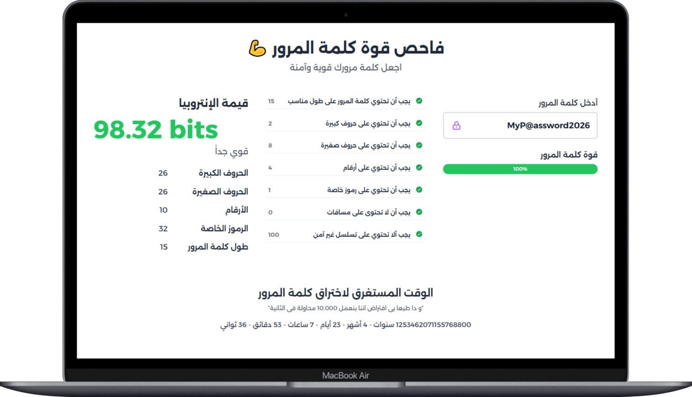
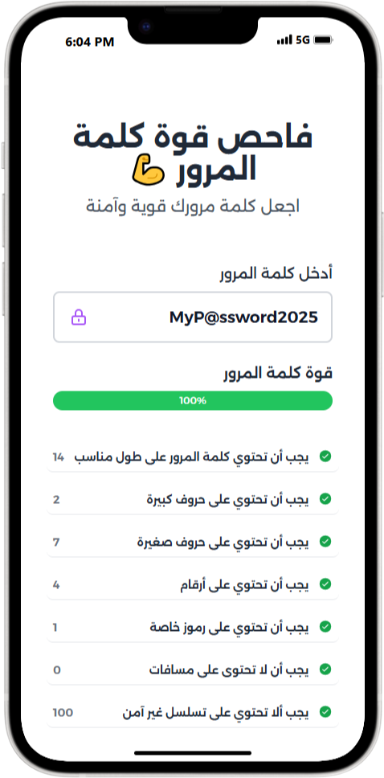

<a href="https://checkmypass-2a096.web.app/">
    
<a>
<h1 style="Font-size:50px;Font-wight:100" > Password Strength Analyzer</h1>
     

This project is a **Password Strength Analyzer** designed to evaluate the strength of passwords based on various factors. It assesses the length, complexity, entropy, and common patterns (such as dictionary words and sequential characters). The tool also provides actionable recommendations for creating stronger passwords.

## Images

  

 

  
  

## Features

- **Length Evaluation**: Checks if the password meets the minimum recommended length (e.g., 8 characters).
- **Complexity Analysis**: Evaluates if the password contains a mix of uppercase letters, lowercase letters, digits, and special characters.
- **Entropy Calculation**: Measures the randomness of the password using entropy calculations to provide an objective strength metric.
- **Pattern Detection**: Identifies common patterns such as:
  - Dictionary words (e.g., "password" or "letmein").
  - Sequential characters (e.g., "1234" or "abcd").
  - Repeated characters (e.g., "aaaa" or "1111").
- **Strength Rating**: Provides an overall password strength rating categorized as:
  - Weak
  - Medium
  - Strong
- **Recommendations**: Offers actionable suggestions for creating a stronger password, such as increasing length or adding special characters.

## Formula Used:

### $$\[ H = \log_2 \left( N^L \right) \]$$

Where:
- \( N \) is the number of possible characters used (e.g., 26 for lowercase letters, 52 for uppercase + lowercase, 62 for letters and numbers).
- \( L \) is the password length.

## Example:

For a password of length 8 using letters and numbers (62 possibilities):

$$\[ H = \log_2 (62^8) \approx 47.9 \text{ bits of entropy} \]$$

## Interpretation:

- **Higher entropy** implies greater password strength, making it more resistant to brute-force attacks.
- Entropy is measured in bits, with each additional bit doubling the number of guesses required.

## Practical Notes:

1. **Character Set Size (\( N \))**:
   - Lowercase letters only: 26
   - Uppercase + lowercase letters: 52
   - Letters + numbers: 62
   - Letters, numbers, and special characters: Typically 94 (depending on the allowed special characters).

2. **Password Length (\( L \))**:
   - Increasing \( L \) has a significant impact on entropy due to exponential growth.
   - A longer password with a smaller character set can often be stronger than a shorter password with a larger character set.

## Key Takeaway:

To maximize password security, aim for a combination of a large character set and sufficient length to achieve high entropy.

## Technologies Used

- **Frontend**:
  - **React.js**: For building a responsive and dynamic user interface.
  - **Tailwind CSS**: For creating modern and visually appealing styles with a utility-first CSS framework.

## Future Enhancements

- **Real-time Feedback**: Provide instant feedback as users type their passwords.
- **Localization**: Support for multiple languages to cater to a broader audience.
- **Dark Mode**: Introduce a dark mode theme for better accessibility and user experience.
- **Browser Extension**: Develop a browser extension for analyzing passwords directly within login forms.
- **Database Integration**: Check passwords against known breached password databases for added security.
